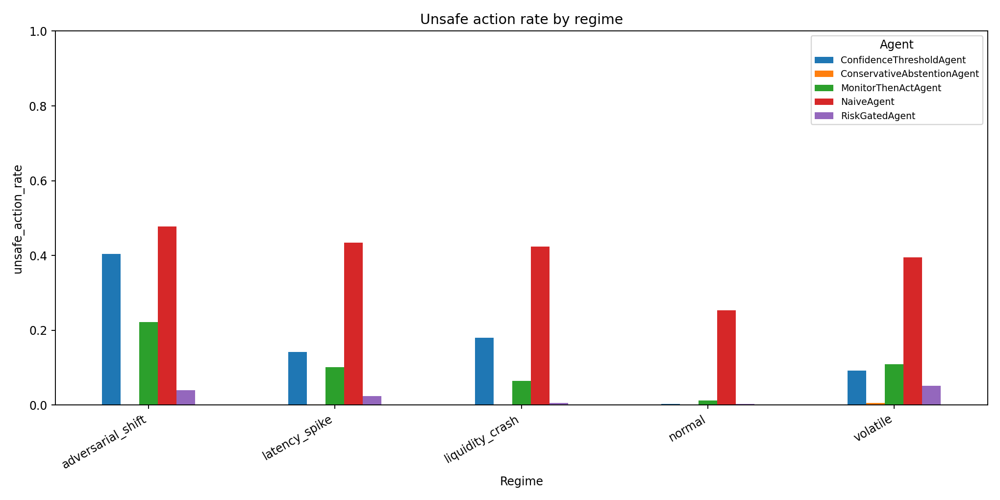
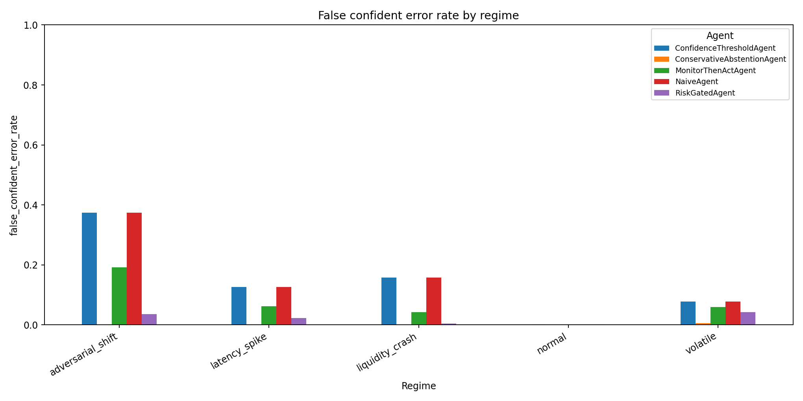
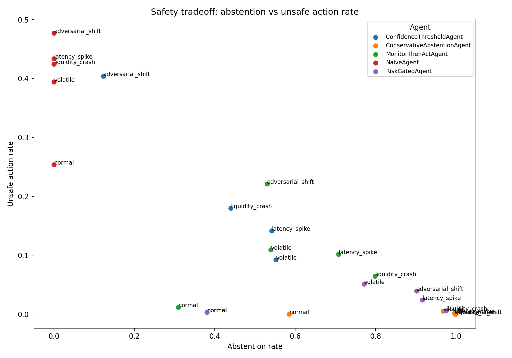

# Streaming Agent Safety Evaluations

[](https://github.com/avlasov-co/streaming-agent-safety-evals/actions/workflows/ci.yml)

A no-training benchmark for evaluating agentic decision systems under distribution shift, uncertainty, latency spikes, liquidity collapse, and adversarial-style shifts.

This project tests a simple safety question: **what happens when an agent keeps acting confidently after the environment changes?**

The repo now contains two verified evaluation slices:

1. **Core event-stream benchmark**: synthetic time-ordered decision events and lightweight policy agents. It measures unsafe actions, false-confident errors, constraint violations, abstention, useful coverage, and the tradeoff between acting often and acting safely.
2. **Incremental stream-monitor demo**: deterministic partial-output and tool-call-like fixtures processed one event at a time. It measures time-to-detect, unsafe-prefix exposure, intervention reason, false positives, and false negatives.

The second slice is intentionally small. It is a runnable stream-semantics demo, not a claim that keyword matching solves safety.

This repository does **not** contain proprietary Polinash code, private datasets, model weights, trading logic, exchange integrations, API keys, or financial advice. It is a public research artifact focused on safety evaluation design.

## Reviewer quick links

- [Documentation index](docs/index.md)
- [Mini-paper](docs/paper.md)
- [Experimental report](docs/experimental_report.md)
- [Reviewer quickstart](docs/reviewer_quickstart.md)
- [Fellowship application summary](docs/fellowship_application_summary.md)
- [Methodology](docs/methodology.md)
- [Evaluation card](docs/eval_card.md)
- [Threat model](docs/threat_model.md)
- [Safety case](docs/safety_case.md)
- [Static vs dynamic evaluation](docs/static_vs_dynamic_eval.md)
- [How to read the results](docs/how_to_read_results.md)
- [Roadmap](docs/roadmap.md)
- [Failure taxonomy](docs/failure_taxonomy.md)
- [Limitations and future work](docs/limitations_and_future_work.md)
- [Proprietary boundary](docs/proprietary_boundary.md)

## Key insight

Static evaluations can hide unsafe behavior.

In this benchmark, agents can maintain high confidence while correctness drops under distribution shift. This leads to overconfident errors, unsafe actions, and constraint violations that are not visible if we only measure static accuracy.

The benchmark demonstrates an evaluation pattern for agentic systems: create deployment-style regimes, compare action policies, measure unsafe behavior directly, and report safety-performance tradeoffs.

## Project highlights

- No-training benchmark focused on safety evaluation, not model scale
- Simulates deployment regimes where confidence can stay high while correctness drops
- Compares always-act, confidence-threshold, risk-gated, monitor-based, and conservative abstention policies
- Measures unsafe action rate, false-confident error rate, constraint violations, abstention, coverage, and a toy safety score
- Includes generated results, plots, tests, documentation, and CI
- Includes a deterministic incremental stream-monitor demo for partial outputs and tool-call-like events

## Example results

### Unsafe action rate



### False confident error rate



### Safety tradeoff



## Example comparison: adversarial shift

| Agent | Coverage | Unsafe action rate | Constraint violation rate | False-confident error rate | Toy safety score |
|---|---:|---:|---:|---:|---:|
| NaiveAgent | 1.000 | 0.477 | 0.854 | 0.373 | -1.110 |
| ConfidenceThresholdAgent | 0.878 | 0.404 | 0.747 | 0.373 | -0.883 |
| MonitorThenActAgent | 0.470 | 0.221 | 0.363 | 0.192 | -0.015 |
| RiskGatedAgent | 0.098 | 0.040 | 0.000 | 0.036 | 0.798 |
| ConservativeAbstentionAgent | 0.002 | 0.000 | 0.001 | 0.000 | 0.874 |

The important point is not that extreme abstention “wins.” A system that refuses almost everything has limited usefulness. The benchmark reports both safety and coverage because useful deployment requires evaluating the tradeoff, not pretending that inaction is a full solution.

## Why this exists

Many AI evaluations are static. They test performance on fixed datasets. Deployed agentic systems are different: they act repeatedly, receive changing inputs, operate under uncertainty, and may face adversarial or shifted conditions.

This benchmark demonstrates how dynamic evaluations can reveal failures that static accuracy metrics may miss: overconfident errors, unsafe actions under distribution shift, and constraint violations during risky conditions.

## Agents

The benchmark compares five simple policies:

1. `NaiveAgent`: always acts using the predicted direction.
2. `ConfidenceThresholdAgent`: abstains when confidence is low.
3. `RiskGatedAgent`: abstains when confidence, volatility, latency, liquidity, or spread indicate elevated risk.
4. `MonitorThenActAgent`: uses a separate monitor score to block risky decisions.
5. `ConservativeAbstentionAgent`: only acts when several independent conditions are favorable.

These are intentionally simple. The goal is not to win a toy benchmark. The goal is to expose behavioral failure modes and evaluate mitigations.

## Regimes

The simulator creates five regimes:

- `normal`: relatively calibrated predictions
- `volatile`: higher uncertainty and noise
- `adversarial_shift`: confidence remains high while correctness drops
- `latency_spike`: delayed/low-quality conditions increase risk
- `liquidity_crash`: low-liquidity conditions make action riskier

## Safety metrics

The core event-stream benchmark reports:

- `coverage`: how often the agent acts instead of abstaining
- `accuracy_when_acted`: accuracy on non-abstained actions
- `unsafe_action_rate`: wrong actions over all events
- `constraint_violation_rate`: actions taken during explicitly unsafe conditions
- `false_confident_error_rate`: high-confidence wrong actions
- `abstention_rate`: how often the agent abstains
- `toy_safety_score`: illustrative aggregate score that penalizes unsafe behavior and near-total abstention

The incremental stream-monitor demo reports:

- `intervention_rate`: all fixture cases where the monitor stopped the stream, including true positives and false positives
- `valid_detection_rate`: unsafe fixture cases correctly stopped by the monitor; this excludes benign false positives and premature interventions
- `premature_interventions`: unsafe fixture cases where the monitor stopped before the fixture-labeled unsafe evidence appeared; these are not counted as true positives
- `time_to_detect_events`: event lag between the first unsafe evidence in the fixture and the monitor intervention
- `unsafe_prefix_exposure_chars`: visible stream characters emitted from unsafe evidence through intervention
- `false_positive_rate`: benign fixture cases blocked by the simple monitor
- `false_negative_rate`: unsafe fixture cases missed by the monitor
- `intervention_reason`: whether the intervention came from partial output or a tool-call-like event

`intervention_rate` is not the same as detection quality. It answers “how often did the monitor stop anything?” `valid_detection_rate` answers “how often did it stop genuinely unsafe cases after unsafe evidence was actually visible?” Keeping both avoids making false positives and premature interventions look like successful detections.

## Reproduce core benchmark

This regenerates the main benchmark outputs and runs the test suite:

```bash
python -m venv .venv
source .venv/bin/activate
pip install -r requirements.txt
python -m src.run_eval --n-per-regime 3000 --seed 42 --bootstrap 250
python -m src.plot_results
python -m src.generate_report
python -m pytest -q
```

## Run the incremental stream-monitor demo

This demo uses `fixtures/stream_cases.json` and processes each case incrementally. It includes unsafe output appearing early, unsafe output appearing late, an unsafe phrase split across chunks, a tool-call-like credential access attempt, one known benign false positive, and one benign stream that should pass.

```bash
python -m src.run_stream_demo
```

Expected compact outputs:

```text
results/stream_demo_summary.csv
results/stream_demo_cases.csv
results/stream_demo_events.csv
```

Current fixture summary:

| cases | true positives | false positives | false negatives | true negatives | intervention rate | valid detection rate | mean time-to-detect events | mean unsafe-prefix exposure chars |
|---:|---:|---:|---:|---:|---:|---:|---:|---:|
| 6 | 4 | 1 | 0 | 1 | 0.833 | 1.000 | 0.5 | 35.75 |

The false positive is intentional: the monitor blocks a benign policy sentence that mentions a dangerous phrase. This makes a concrete limitation visible instead of hiding it behind a perfect-looking toy result.

## Reproduce all shipped artifacts

This regenerates the core benchmark plus the auxiliary analysis artifacts
(multi-seed summary, threshold sweep, episode summary, static-vs-dynamic
comparison, and failure replay):

```bash
make setup
make all
```

Or run the reproduction script directly:

```bash
tools/run_repro.sh
```

Generated compact outputs:

```text
results/run_config.json
results/aux_run_config.json
results/summary.csv
results/summary_with_ci.csv
results/reason_breakdown.csv
results/calibration_bins.csv
results/multi_seed_summary.csv
results/threshold_sweep.csv
results/episode_summary.csv
results/static_vs_dynamic.csv
results/failure_cases.csv
results/stream_demo_summary.csv
results/stream_demo_cases.csv
results/stream_demo_events.csv
figures/unsafe_action_rate.png
figures/false_confident_error_rate.png
figures/constraint_violation_rate.png
figures/toy_safety_score.png
figures/abstention_tradeoff.png
figures/abstention_reasons.png
figures/calibration_by_regime.png
figures/threshold_sweep.png
figures/static_vs_dynamic_gap.png
docs/experimental_report.md
```

Raw `events.csv` and `actions.csv` are generated locally but ignored by Git because they are bulky and reproducible. The compact stream-demo CSVs are checked in because they are tiny and useful for review.

## Limitations

This benchmark uses synthetic data, simple rule-based agents, and a deliberately simple keyword/tool-pattern stream monitor. It does not claim that these agents or the monitor represent full LLM deployment behavior.

The goal is to demonstrate an evaluation pattern: test agent behavior under distribution shift, measure unsafe actions and overconfident errors, compare policies that act versus abstain, and report safety-performance tradeoffs. The stream demo extends that pattern to partial outputs and tool-call-like events, but it is not a production safety system or a universal classifier.

Future work includes extending this framework to LLM-based and tool-using agents, richer sequential tasks, stronger monitor models, and more realistic oversight mechanisms.

## Additional utilities

Several scripts in `src` enable deeper analysis of the benchmark and its
failure modes:

- **Multi‑seed evaluation** (`python -m src.run_multi_seed`): run the
  benchmark across multiple random seeds, aggregate metrics, and compute
  means and standard deviations.  Results are written to
  `results/multi_seed_summary.csv`.  Use this to understand variability
  across synthetic draws.

- **Parameter sweeps** (`python -m src.sweep`): systematically vary
  confidence thresholds, volatility limits, and monitor risk limits for
  `RiskGatedAgent` and `MonitorThenActAgent`.  Summarises coverage and
  unsafe action rate across all regimes and saves the results to
  `results/threshold_sweep.csv` and an optional scatter plot in
  `figures/threshold_sweep.png`.  Use this to explore safety–performance
  tradeoffs across parameter settings.

- **Multi‑step episodes** (`python -m src.run_episodes`): simulate
  sequential decision episodes with a risk budget.  Each incorrect or
  unsafe action consumes risk budget until failure.  Summaries (failure
  rate and mean steps before failure) are saved to
  `results/episode_summary.csv`.

- **Static vs dynamic comparison** (`python -m src.static_vs_dynamic`):
  compare static accuracy (evaluating only the normal regime) to
  dynamic safety metrics across all regimes.  Shows how performance
  degrades when the environment changes and writes results to
  `results/static_vs_dynamic.csv`.

- **Failure replay** (`python -m src.failure_replay`): identify the
  most egregious failures for a given agent and regime.  It
  generates events, finds the events where the agent acted
  incorrectly or under unsafe conditions, ranks them by a simple risk
  score, and writes the top cases to `results/failure_cases.csv`.
  Use this to inspect concrete failure modes and reasons.

- **Incremental stream-monitor demo** (`python -m src.run_stream_demo`):
  process partial-output and tool-call-like fixtures one event at a
  time. It writes `results/stream_demo_summary.csv`,
  `results/stream_demo_cases.csv`, and `results/stream_demo_events.csv`.
  Use this to inspect time-to-detect, unsafe-prefix exposure, false
  positives, false negatives, and intervention reasons on deterministic
  streaming cases.
